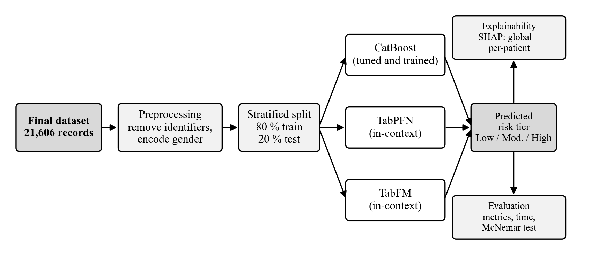
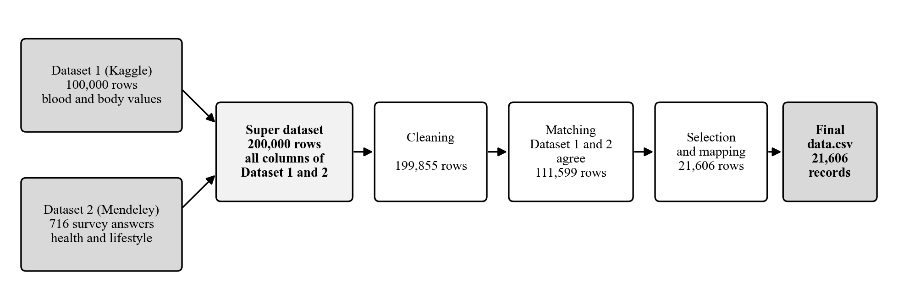
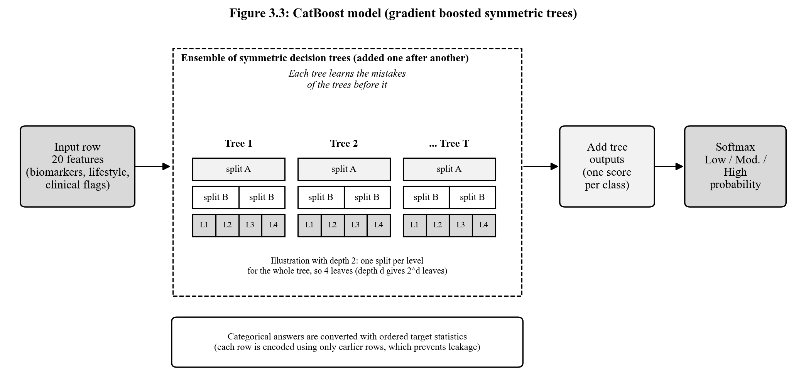
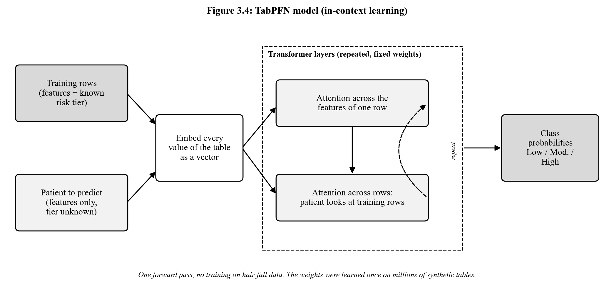
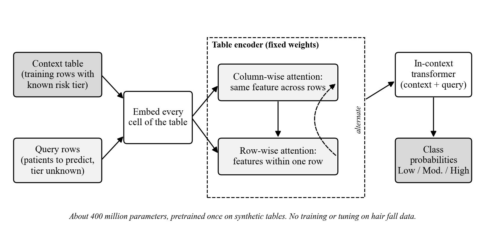
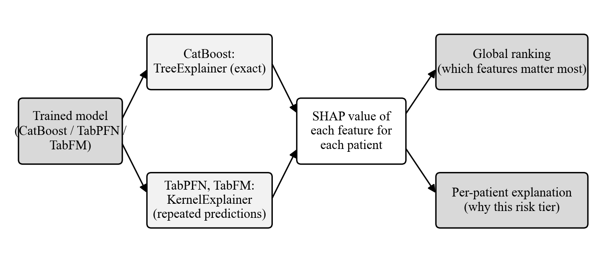
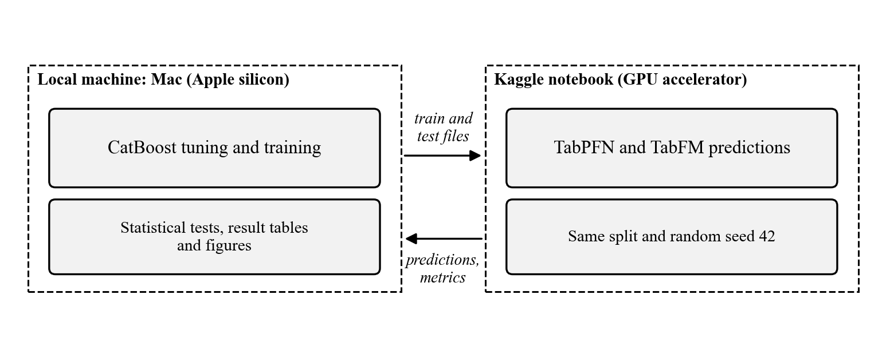

# Chapter 3: Methodology

## 3.1 Research Framework

The study follows one pipeline from data to explanation, shown in Figure 3.1. The final dataset is cleaned and split once. The same training and test rows are then given to three models, CatBoost, TabPFN, and TabFM. To see how each model behaves when little data is available, each will also be given two smaller stratified subsets of the training rows (500 and 2,000 records) in addition to all 17,284. Their predictions are compared with the same metrics and statistical tests, and SHAP is applied to all three so that each predicted risk tier can be traced to its features.

**Figure 3.1:** Overall research framework

## 3.2 Dataset Description

### 3.2.1 Source datasets and how they are related

Two public datasets were the sources of the data.

**Dataset 1** (Dhankour, 2023) has 100,000 records and 13 columns: age, gender, ten numeric measurement columns (total_protein, total_keratine, hair_texture, vitamin, manganese, iron, calcium, body_water_content, stress_level, and liver_data), and the target hair_fall with values from 0 to 5.

**Dataset 2** (Arnob et al., 2024) is a survey of 716 people with 14 columns: a timestamp, the name of the respondent (removed before use), age, gender, whether the person has a hair fall problem, eight yes/no questions (family history of hair fall, chronic illness, staying up late, sleep disturbance, water as a reason, use of chemicals on hair, anemia, and stress), and food habit.

A super dataset of 200,000 records was taken. It contains all the fields of Dataset 1 and Dataset 2 and many additional fields (for example age group, hair fall tier, and number of risk factors). In the super dataset, age and gender were identified and the records were kept according to them. It was compared with Dataset 1 and Dataset 2, and this gave the final dataset of 21,606 records that is used in this study.

**Table 3.1:** The source datasets, the super dataset, and the final dataset

| Dataset | Source | Rows | Columns | Content | Row identifier |
|---|---|---|---|---|---|
| Dataset 1 | Kaggle "Hair Loss Dataset" (Dhankour, 2023) | 100,000 | 13 | age, gender, 10 numeric measurement columns, and hair_fall (0 to 5) | Age and gender |
| Dataset 2 | Mendeley "Dataset for evaluating hair fall causes" (Arnob et al., 2024) | 716 | 14 | Questionnaire: age, gender, 8 Yes/No health and lifestyle answers, hair fall problem, food habit | Age and gender |
| Super dataset | Consolidated health dataset | 200,000 | All columns of both and many additional fields | Every column of Dataset 1 and Dataset 2 and additional derived fields | Age and gender |
| Final dataset | Derived from Dataset 1, Dataset 2, and the super dataset | 21,606 | 23 | 20 features and the 3-tier target hair_fall | id (1 to 21,606) |

**Figure 3.2:** Relationship between the source datasets and the final dataset

**Table 3.2:** Columns of the final dataset and where they come from

| Final dataset column | Meaning | Unit or coding | Dataset 1 | Dataset 2 | Super dataset |
|---|---|---|---|---|---|
| age | Age of the person | Years | age | age | Both |
| gender | Sex of the person | Female, Male, Other | gender | gender | Both |
| total_protein | Serum total protein | g/dL | total_protein | none | Dataset 1 |
| calcium | Serum calcium | mg/dL | calcium | none | Dataset 1 |
| iron | Serum iron | µg/dL | iron | none | Dataset 1 |
| vitamin_d | Serum 25-hydroxy vitamin D | ng/mL | vitamin | none | Dataset 1 |
| alt_liver | Liver enzyme ALT | U/L | liver_data | none | Dataset 1 |
| manganese | Whole blood manganese | µg/L | manganese | none | Dataset 1 |
| body_water_content | Body water content | % | body_water_content | none | Dataset 1 |
| stress_level | Stress score | 0 to 40 | stress_level | none | Dataset 1 |
| total_keratine | Hair keratin score | 0 to 100 | total_keratine | none | Dataset 1 |
| hair_texture | Hair texture score | 0 to 100 | hair_texture | none | Dataset 1 |
| family_hair_fall_history | Family member with hair fall or baldness | 0 = No, 1 = Yes | none | Family history | Dataset 2 |
| chronic_illness | Chronic illness in the past | 0 = No, 1 = Yes | none | Chronic illness | Dataset 2 |
| late_night_sleep | Stays up late at night | 0 = No, 1 = Yes | none | Stay up late | Dataset 2 |
| sleep_disturbance | Any sleep disturbance | 0 = No, 1 = Yes | none | Sleep disturbance | Dataset 2 |
| water_reason | Water in the area seen as a reason | 0 = No, 1 = Yes | none | Water as a reason | Dataset 2 |
| chemical_use | Uses chemicals, gel, or colour on hair | 0 = No, 1 = Yes | none | Chemical use | Dataset 2 |
| anemia | Has anemia | 0 = No, 1 = Yes | none | Anemia | Dataset 2 |
| stress | Feels too much stress | 0 = No, 1 = Yes | none | Stress | Dataset 2 |
| hair_fall (target) | Hair fall risk tier | 0 Low, 1 Moderate, 2 High | hair_fall (0 to 5) | Hair fall problem | Both |

### 3.2.2 The final dataset

The final dataset has 21,606 records with 20 features and one target.

- **Demographics and heredity:** age (20 to 55 years), gender, family_hair_fall_history.
- **Blood and body measurements:** total_protein, calcium, iron, vitamin_d, alt_liver (alanine aminotransferase, ALT), manganese, body_water_content, stress_level, total_keratine, and hair_texture.
- **Clinical conditions (0/1):** chronic_illness, anemia, stress.
- **Lifestyle and environment (0/1):** late_night_sleep, sleep_disturbance, water_reason, chemical_use.
- **Target hair_fall:** 0 = Low (9,723 records, 45%), 1 = Moderate (7,562, 35%), 2 = High (4,321, 20%).

## 3.3 Data Preprocessing

The following steps were applied to the final dataset before any model was run.

1. **Removal of identifiers.** The id column and the full_name column (which holds personal names in encoded form) were removed, because they do not describe health and could create false patterns. After removal, 20 features remain.
2. **Quality checks.** The dataset has no missing values and no duplicate records (ignoring id).
3. **Clinical range check.** Each blood and body measurement was compared with its normal reference range and with limits that are physiologically impossible. No values were impossible, so no record was removed. Values outside the normal range were kept on purpose, because they are the information that indicates risk.
4. **Encoding.** Gender was coded 0 = Female, 1 = Male, 2 = Other. The yes/no columns were already 0/1, and the target was already coded 0, 1, 2.
5. **Stratified split.** The records were split 80% to 20% with the class shares kept equal (random seed 42): 17,284 training records and 4,322 test records, with 45% Low, 35% Moderate, and 20% High in both parts.
6. **Training sizes.** Three training sizes were prepared from the 17,284 training records: 500 records, 2,000 records, and all 17,284. The smaller sets were drawn with the class shares kept equal (45% Low, 35% Moderate, 20% High). The same 4,322 test records are used for every size and every model.

## 3.4 Model Selection

Three models from different families are compared: a tuned gradient boosting model (CatBoost) and two tabular foundation models that predict without training (TabPFN and TabFM).

### 3.4.1 CatBoost

**Figure 3.3:** CatBoost model (gradient boosted symmetric trees)

CatBoost builds many small decision trees one after another, and each new tree h_t is trained to correct the mistakes of the ensemble F_(t-1) built so far, by minimising

$$\mathcal{L}^{(t)}=\sum_{i=1}^{n} l\big(y_i,\;F_{t-1}(x_i)+h_t(x_i)\big)+\Omega(h_t)\tag{i}$$

where l is the multi-class cross-entropy loss, y_i is the true tier of record i, and Ω(h_t) is a penalty on the complexity of the new tree, which limits overfitting. All trees are symmetric, meaning that one split is used for a whole level of the tree, which makes the model fast and hard to overfit. The tree outputs are added to give one score s_k for each risk tier k, and a softmax turns the three scores into probabilities:

$$P(y=k\mid x)=\frac{e^{s_k}}{\sum_{j=1}^{3}e^{s_j}}\tag{ii}$$

Categorical answers are encoded using only earlier rows, which avoids target leakage (Prokhorenkova et al., 2018). CatBoost is the only model that will be trained and tuned on the hair fall data. Its tuning will be a grid search over tree depth and learning rate, scored by macro-F1 with 5-fold cross-validation on the training rows only, so that the test set stays untouched. The two foundation models will not be tuned.

### 3.4.2 TabPFN

**Figure 3.4:** TabPFN model (in-context learning)

TabPFN is a transformer that was trained beforehand on millions of synthetic tables (Hollmann et al., 2025). To predict, it receives the training rows together with their known risk tiers and the patient to be predicted. Every value is turned into a vector, and attention layers let the model relate the features of a row and relate the patient to the training rows. The class probabilities are produced in a single forward pass:

$$P(y\mid x_{test},\,D_{train})=f_{\theta}\big(x_{test},\,D_{train}\big)\tag{iii}$$

where D_train is the set of training rows with their tiers and f_θ is the pretrained network with fixed weights θ. No weights are changed, so nothing is trained on the hair fall data. TabFM works in the same way, with its own network in place of f_θ.

### 3.4.3 TabFM

**Figure 3.5:** TabFM model (zero-shot tabular foundation model)

TabFM is a model of about 400 million parameters developed by Google Research and pretrained on synthetic tables (Kong et al., 2026). Like TabPFN, it takes the training rows as context and predicts in one forward pass without tuning. Its table encoder alternates attention along columns and along rows, and an in-context transformer then combines the context rows with the query rows to give the class probabilities. It was published in 2026 and has been tested by others only on general benchmarks (Pandey, 2026), so how it behaves on real health data is one of the open questions of this study.

## 3.5 Explainability with SHAP

**Figure 3.6:** SHAP explainability workflow

SHAP splits a prediction into one contribution per feature, based on Shapley values from game theory (Lundberg & Lee, 2017). The contributions add up to the difference between the model's output and its average output:

$$f(x)=\phi_0+\sum_{j=1}^{20}\phi_j\tag{iv}$$

where f(x) is the model output for a patient x, φ₀ is the average prediction and φⱼ is the contribution of feature j (for example iron or stress_level) to the predicted risk tier.

## 3.6 Tools and Technologies

**Table 3.3:** Software tools

| Purpose | Tool | Version |
|---|---|---|
| Language | Python | 3.12.14 |
| Data handling | pandas, NumPy | 3.0.6, 2.5.3 |
| Split, metrics, cross-validation | scikit-learn | 1.9.1 |
| Statistical tests | statsmodels (McNemar's test, Wilson intervals) | 0.15.0 |
| Gradient boosting model | CatBoost | 1.2.10 |
| Foundation model 1 | TabPFN | 9.0.0 |
| Foundation model 2 | TabFM (weights from Hugging Face: google/tabfm-1.0.0-pytorch) | 1.0.1 |
| Explainability | SHAP | 0.52.0 |
| Deep learning backend | PyTorch | 2.14.0 |
| Charts | Matplotlib | 3.11.2 |
| Workflow | Local lab application (notebook-style steps) with PostgreSQL and MinIO | — |
| GPU runs | Kaggle notebooks | — |

Package versions used on Kaggle are recorded at the start of each notebook and reported with the results.

## 3.7 Experimental Environment

The work is divided between two environments (Figure 3.7).

**Figure 3.7:** Experimental environment

**Local machine.** Data preparation and the split have already been done on an Apple-silicon Mac (macOS, 17.2 GB memory, Apple GPU) with Python 3.12, and CatBoost tuning and training, the statistical tests, and the result tables and figures will be run there as well. The steps are run one by one in a local lab application that stores the data in PostgreSQL and the outputs in MinIO, so every run is saved and can be reopened.

**Kaggle notebooks.** TabFM and TabPFN need a GPU to make their predictions in reasonable time, and TabFM is the largest model (about 6.5 GB of weights). These runs will therefore be done in Kaggle notebooks, which offer more GPU capacity than Google Colab. The train and test files created on the local machine are uploaded to the notebook, and the metrics and predictions are downloaded back for comparison. SHAP for the two foundation models will also be run there.

To keep the comparison fair, all three models use the same split and the same random seed (42), and the environment of every session (Python, GPU, memory, package versions) is recorded and reported.

## 3.8 Performance Evaluation Metrics

Model performance will be measured on the same held-out test set for every model. Because the three risk tiers are not equally common (45%, 35%, 20%), the class-averaged (macro) versions of the metrics are used, so that the smaller High tier counts as much as the Low tier. Here TP_k, FP_k, and FN_k are the true positives, false positives, and false negatives of tier k. Each equation is numbered on the right and cited in the text as Equation (i), (ii), and so on.

**Accuracy** is the share of test records whose tier is predicted correctly, where N is the number of test records:

$$\text{Accuracy}=\frac{TP_1+TP_2+TP_3}{N}\tag{v}$$

**Precision** shows how trustworthy a predicted tier is. It is computed for each tier k and then averaged over the three tiers (macro-precision):

$$\text{Precision}_k=\frac{TP_k}{TP_k+FP_k},\qquad \text{Macro-Precision}=\frac{1}{3}\sum_{k=1}^{3}\text{Precision}_k\tag{vi}$$

**Recall** shows how many patients of a tier are found (macro-recall is the average over the three tiers):

$$\text{Recall}_k=\frac{TP_k}{TP_k+FN_k},\qquad \text{Macro-Recall}=\frac{1}{3}\sum_{k=1}^{3}\text{Recall}_k\tag{vii}$$

**Macro-F1** is the harmonic mean of precision and recall for each tier, averaged over the tiers:

$$F1_k=\frac{2\,\text{Precision}_k\,\text{Recall}_k}{\text{Precision}_k+\text{Recall}_k},\qquad \text{Macro-F1}=\frac{1}{3}\sum_{k=1}^{3}F1_k\tag{viii}$$

**ROC-AUC** is the area under the receiver operating characteristic (ROC) curve of each tier against the other two (one-versus-rest), averaged over the three tiers. It measures how well the predicted probabilities rank patients, independent of any cut-off:

$$\text{Macro ROC-AUC}=\frac{1}{3}\sum_{k=1}^{3}AUC_k\tag{ix}$$

- **Confusion matrix:** shows which tiers are mixed up. This matters here because the tiers are ordered, and confusing Low with High is a worse mistake than confusing neighbouring tiers.
**Statistical significance.** McNemar's test will be applied to every pair of models on the test set, to decide whether a difference in the number of correct predictions is larger than chance. Let b be the number of records that only the first model predicts correctly and c the number that only the second model predicts correctly:

$$\chi^2=\frac{(|b-c|-1)^2}{b+c}\tag{x}$$

with one degree of freedom (the −1 is the continuity correction). The accuracy of each model is also given with a 95% Wilson confidence interval, where p̂ is the accuracy, n is the number of test records, and z = 1.96:

$$\frac{\hat p+\dfrac{z^2}{2n}\pm z\sqrt{\dfrac{\hat p(1-\hat p)}{n}+\dfrac{z^2}{4n^2}}}{1+\dfrac{z^2}{n}}\tag{xi}$$
