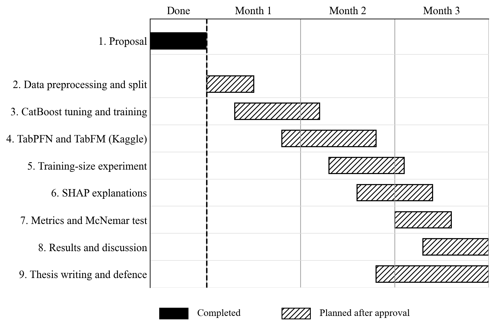

# Chapter 4: Expected Outcome and Working Schedule

## 4.1 Expected Outcomes

The expected outcomes follow from the research gap found in the literature review (Section 2.2.1) and from the two objectives in Section 1.3. They are stated as aims to be tested, not as findings, because the experiments are still to be carried out.

**1. A fair benchmark of different model families on hair fall data (Objective 1).** Earlier hair fall studies compared only classical algorithms, on different datasets, with accuracies ranging from about 50% to 100% (Khatun et al., 2022; Kumar et al., 2025; Siami & Azis, 2025). This study is expected to give a comparison that can be trusted, because CatBoost, TabPFN, and TabFM use the same 21,606 records, the same train and test split, the same random seed, and the same metrics.

**2. A properly tuned gradient boosting baseline (Objective 1).** CatBoost scored only 49.5% in the one earlier hair fall study that included it, apparently without tuning (Kumar et al., 2025). Here CatBoost is tuned with a grid search and cross-validation on the training data only, so it is expected to be a strong and fair baseline. Any advantage of a foundation model over it would then be meaningful.

**3. The first test of tabular foundation models on hair fall risk (Objective 1).** TabPFN and TabFM performed well on general benchmarks (Hollmann et al., 2025; Kong et al., 2026), and this study expects them to be competitive with tuned CatBoost on hair fall data without any tuning, especially when only a small part of the training data is used. This is an expectation taken from the benchmark literature, and the study is designed so that it can also show the opposite. A difference between the models is accepted only if McNemar's test shows that it is larger than chance.

**4. A record of the practical limits of TabFM (Objective 1).** An independent reproduction reported software defects and memory failures on larger tables (Pandey, 2026). The study is expected to document how TabFM behaves on a real health dataset, including how much training data it can take, how long it runs, and what problems appear, so that later researchers know what to expect.

**5. A side-by-side comparison of explanations (Objective 2).** SHAP is expected to show which measurements and habits drive each model's predicted tier, and to show whether the three models agree. The factors that the models rely on are expected to match what Chapter 2 describes as the biological causes of hair loss, such as iron level, stress, and family history. Agreement would support the use of the models as decision support. Disagreement would be reported as a finding and not hidden.

**Table 4.1:** Expected outcomes and how they will be checked

| Research gap | Expected outcome | How it will be checked | Method in Chapter 3 |
|---|---|---|---|
| Only classical models, different datasets | Fair three-model benchmark | Same data, split, seed, and metrics | Sections 3.3, 3.8 |
| CatBoost not tuned | Strong tuned baseline | Grid search with cross-validation on training data | Section 3.4.1 |
| Foundation models not tested on hair fall | Competitive results without tuning, to be confirmed | Macro-F1 and ROC-AUC, McNemar's test, Wilson intervals | Sections 3.4.2, 3.4.3, 3.8 |
| TabFM limits unknown | Documented limits of TabFM | Recorded settings, problems, and run conditions | Section 3.7 |
| Explanations not compared | Comparable SHAP explanations for all three models | Global ranking and per-patient explanations | Section 3.5 |

Beyond the individual outcomes, the study is expected to show whether explainable, data-efficient tabular modelling can be a practical alternative to heavily tuned gradient boosting for structured health risk prediction, and to leave a documented and reproducible pipeline that others can rerun on their own data.

## 4.2 Working Schedule

The work is planned over six months, with the schedule shown as a Gantt chart in Figure 4.1. The tasks on the left are split into what has already been done up to this proposal (black bars) and what will be done after the proposal is approved (hatched bars). The completed tasks are the problem formulation, the literature review, the comparison and preparation of the datasets, the preprocessing and split, and the setup of the local environment and pipeline code. The planned tasks follow the order of the methodology in Chapter 3: model training, the training-size experiment, SHAP, evaluation, discussion, and thesis writing.

**Figure 4.1:** Working schedule (Gantt chart)
