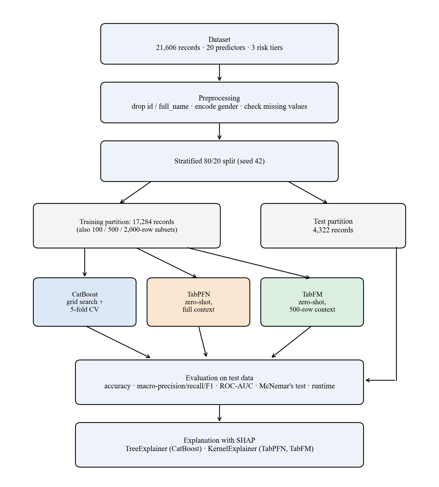

CHAPTER 3
METHODOLOGY

This chapter describes how the study was conducted to meet the research objectives stated in Section 1.4. It covers the research design and approach, the study area and population, sample selection and size, the data collection, the data analysis approach and tools, and the ethical considerations. Table 3.1 links each method to the objective it serves.

Table 3.1: Link between the research objectives and the methods used

| Specific objective (Section 1.4) | Method used | Section |
|---|---|---|
| 1. Compare predictive performance and test significance | Common train/test split, CatBoost tuning, TabPFN and TabFM inference, macro-averaged metrics, ROC-AUC, McNemar's test | 3.5, 3.8.3, 3.8.4, 3.8.7 |
| 2. Evaluate the effect of training context size | Retraining all three models on 100, 500 and 2,000 training rows | 3.8.5 |
| 3. Explain predictions with SHAP | Descriptive analysis of the data; TreeExplainer for CatBoost, KernelExplainer for TabPFN and TabFM | 3.8.2, 3.8.6 |
| 4. Assess computational cost and implementation limitations | Recording runtimes and documenting implementation problems | 3.8.8 |

3.1 Research design

The study used a quantitative, experimental design based on secondary data. It was a model-comparison (benchmarking) study: the same dataset, the same train/test partition and the same evaluation measures were applied to three models, so that differences in results could be attributed to the models and not to the data. No primary data were collected from people, so there was no field study area and no direct contact with respondents.

The study followed the pipeline in Fig. 3.1. The data were preprocessed and split once. CatBoost was tuned and trained on the training partition, while TabPFN and TabFM received the training rows as context without any training. All three models were evaluated on the same held-out test partition, compared with a statistical test, examined with reduced training contexts, and explained with SHAP.

The design was chosen because the research questions ask for a like-for-like comparison of models on one task. An experimental design is appropriate when the aim is to compare methods under controlled conditions, and a benchmarking study fits the objectives because none of them requires new data collection: each asks how existing methods behave on a defined task. A design based on a new prediction method would have answered a different question. A single fixed split and a fixed random seed (42) made the results reproducible. Each stage of Fig. 3.1 is linked to an objective in Table 3.1, so that no step was included without a purpose in the research.

3.2 Research approach

A quantitative, deductive approach was used. The proposition examined was that zero-shot tabular foundation models can match a tuned gradient-boosted model on multi-tier hair fall risk classification. It was examined with numerical performance measures and a statistical test, and the predictions were then explained with SHAP. A quantitative approach was suitable because the research questions ask about measurable differences in performance, data efficiency and feature contribution.

3.3 Study area

The study was not a field study, so there was no geographical study area. The data were taken from two public datasets [@dhankour], [@mendeley], and all experiments were run in cloud notebook environments (Section 3.8.9).

3.4 Study population

The population was the set of patient records describing demographic, biochemical, clinical and lifestyle attributes related to hair fall. The dataset had 21,606 records with 23 columns: an identifier (id), a name (full_name), 20 predictor variables and the target variable hair_fall. There were no duplicate rows and no missing values. The target had three ordinal tiers: 0 (Low, 9,723 records, 45.0%), 1 (Moderate, 7,562 records, 35.0%) and 2 (High, 4,321 records, 20.0%). The classes were therefore unequal in size, which is the reason for the macro-averaged measures in Section 3.8.7.

3.5 Sample selection

The whole dataset was used, so no separate sampling of records was done. It was divided into a training and a test partition by a stratified 80/20 split with a fixed random seed of 42, so that class proportions were preserved in both parts. The test partition was held out and was not used for tuning CatBoost's hyperparameters. The same partition was used for all three models.

For the training-context experiment (Section 3.8.5), smaller training samples of 100, 500 and 2,000 rows were drawn at random (seed 42) from the training partition. TabFM's main evaluation used a 500-row context drawn in the same way.

3.6 Sample size

The full dataset had 21,606 records. The split gave 17,284 training records and 4,322 test records (1,945 Low, 1,513 Moderate and 864 High). CatBoost and TabPFN used all 17,284 training records, and TabFM used a 500-row context (about 2.9% of the training partition). The reduced-context runs used 100, 500 and 2,000 training rows. The 100-row and 500-row runs were evaluated on all 4,322 test records, and the 2,000-row run on a fixed random subset of 500 test records.

3.7 Methods of data collection

No primary data were collected from people. The study used secondary data and computational modelling and measurement.

The dataset was assembled from two public sources. The physiological biomarker data came from the Kaggle Hair Loss Dataset [@dhankour], chosen for its continuous clinical indicators relevant to hair health. The demographic and lifestyle indicators came from the Mendeley Hair Fall Problem Survey Dataset [@mendeley], chosen for its binary lifestyle and hereditary risk factors. Respondent names were removed before processing. Because the two sources came from different respondent groups, feature values were adjusted using relationships between risk factors and hair loss reported in the dermatological literature, and this produced the final dataset. It was therefore a constructed dataset and not a clinical registry. The consequences for the interpretation of the results are discussed in Chapter 4 and Chapter 5.

The 20 predictor variables fell into four groups (Table 3.2).

Table 3.2: Predictor variables

| Group | Variables |
|---|---|
| Demographics and heredity | age (years); gender (Female, Male, Other); family_hair_fall_history (0/1) |
| Serum and physiological biomarkers | total_protein (g/dL); iron (µg/dL); calcium (mg/dL); vitamin_d (ng/mL); manganese (µg/L); alt_liver (U/L); body_water_content (%); stress_level (0–40, modelled on the Perceived Stress Scale) |
| Hair condition scores | total_keratine and hair_texture (composite 0–100 scores, not standard laboratory measurements) |
| Clinical and lifestyle flags (0/1) | chronic_illness, anemia, stress, late_night_sleep, sleep_disturbance, water_reason (exposure to hard or chemically treated water), chemical_use (hair dyes, relaxers and other chemical treatments) |

Table 3.3 gives the range of the continuous predictors in the full dataset.

Table 3.3: Descriptive statistics of the continuous predictors (all 21,606 records)

| Predictor | Mean | Standard deviation | Minimum | Maximum |
|---|---|---|---|---|
| age (years) | 32.83 | 9.67 | 20.0 | 55.0 |
| total_protein (g/dL) | 7.20 | 0.60 | 4.8 | 9.5 |
| calcium (mg/dL) | 9.30 | 0.60 | 7.0 | 11.5 |
| iron (µg/dL) | 98.47 | 30.94 | 10.0 | 217.0 |
| vitamin_d (ng/mL) | 28.11 | 11.75 | 4.0 | 78.4 |
| alt_liver (U/L) | 25.66 | 13.78 | 5.0 | 81.0 |
| manganese (µg/L) | 8.02 | 2.98 | 1.0 | 20.0 |
| body_water_content (%) | 54.98 | 7.89 | 35.0 | 75.0 |
| stress_level (0–40) | 18.03 | 7.90 | 0.0 | 40.0 |
| total_keratine (0–100) | 49.88 | 19.80 | 0.0 | 100.0 |
| hair_texture (0–100) | 50.16 | 19.67 | 0.0 | 100.0 |

The predictors cover plausible ranges for adults aged 20 to 55 years. The two hair-condition scores span the whole 0 to 100 scale with means near 50, and the stress score spans the whole 0 to 40 scale. The gender attribute had 12,109 male, 9,485 female and 12 other records, so the "other" group was too small to be analysed separately.

Model outputs (predictions, class probabilities, SHAP values) and running times were collected by running the experiments in Section 3.8, which is the measurement part of the study.

3.8 Data analysis approach and tools

The data were analysed in the steps below. The analysis was done in Python, and the tools are listed in Section 3.8.9. The code is given in Appendix A.

3.8.1 Data preprocessing

The following steps were applied before modelling.

1. Identifier removal. The columns id and full_name carry no predictive information and could create false associations, so they were removed.
2. Encoding. The gender attribute was mapped to numbers (0 = Female, 1 = Male, 2 = Other). The target was already coded as 0, 1 and 2, so it needed no change. All other predictors were numeric or binary and were used as they were. TabPFN and TabFM received these raw values without scaling.
3. Missing values. The data were checked and no missing values were found, so no imputation was needed.

No fitted transformation (such as scaling or target encoding) was applied, so the warning of Widowati et al. [@widowati] about leakage from preprocessing did not apply to the modelling stage: nothing was learned from the test records before evaluation.

3.8.2 Descriptive analysis of the dataset

Before modelling, the relationship between each predictor and the risk tier was described in the full dataset. For each continuous predictor, the mean was calculated in each risk tier. For all predictors, Spearman's rank correlation with the ordinal risk tier was calculated. This analysis was done with the pandas and SciPy packages. It was not used to select features or to train any model. Its purpose was to provide an independent reference against which the SHAP explanations could be compared (Section 4.3).

3.8.3 Models and justification

Three models were selected to represent three different approaches to tabular prediction, in line with Objective 1.

3.8.3.1 CatBoost

CatBoost [@prokhorenkova] is a gradient-boosted decision tree method that builds trees one after another, each correcting the errors of the ensemble so far, as described in Section 2.2. At iteration t it minimises a regularised objective:

EQ[cbobj]: \mathcal{L}^{(t)} = \sum_{i} L\big(y_i,\; F_{t-1}(x_i) + h_t(x_i)\big) + \Omega(h_t)

where L is the multi-class cross-entropy loss, F_{t-1} is the ensemble built so far, h_t is the new tree and Ω penalises tree complexity. CatBoost reduces target leakage through ordered target statistics and builds symmetric (oblivious) trees, which limits overfitting. It was selected as the tuned, well-established baseline whose performance the foundation models had to match. Grid search was used to tune two hyperparameters that control model complexity and learning speed: the tree depth (deeper trees model more interactions but overfit more easily) and the learning rate (smaller values need more trees).

3.8.3.2 TabPFN

TabPFN [@hollmann23], [@hollmann25] is a transformer pretrained offline on synthetic datasets. It does not train on the target data. It receives the labelled training rows D_train and a query x_test together and returns the predictive distribution in a single forward pass:

EQ[tabpfn]: P(y_{test} \mid x_{test}, \mathcal{D}_{train}) = \int P(y_{test} \mid x_{test}, \theta)\, P(\theta \mid \mathcal{D}_{train})\, d\theta

This is done with the self-attention mechanism of Eq. ({eq:attention}). TabPFN was selected as the established tabular foundation model, which needs no hyperparameter tuning or feature scaling.

3.8.3.3 TabFM

TabFM [@kong] is a tabular foundation model released by Google Research. It alternates row-wise and column-wise attention over the table before an in-context transformer produces the prediction, and it also needs no training or tuning:

EQ[tabfm]: P(y_{test} \mid x_{test}, \mathcal{D}_{train}) = \mathrm{TabFM}(x_{test}, \mathcal{D}_{train})

TabFM was selected as a second, independently developed foundation model, so that the study could test whether the behaviour of zero-shot models holds for more than one architecture.

3.8.4 Experimental setup

CatBoost. A grid search was run over tree depth {4, 6, 8} and learning rate {0.01, 0.03, 0.1}. Each combination was scored by stratified 5-fold cross-validation on the training partition, using macro-F1. All models used the MultiClass loss, l2_leaf_reg = 3.0, at most 1,000 iterations, early stopping after 50 rounds and a random seed of 42. The best combination was depth = 4 and learning rate = 0.1 (cross-validation macro-F1 = 0.7665). The final model was trained on the full training partition with this setting. In this final fit, early stopping was monitored on the test partition, so the test data influenced the number of trees selected. This is noted as a limitation in Section 5.2.

TabPFN. The default configuration of the TabPFN package was run on a GPU with a random seed of 42. The full training partition (17,284 rows) was supplied as context, and no tuning was done.

TabFM. The PyTorch implementation of TabFM version 1.0.0 was used with a single ensemble member (n_estimators = 1). A context of 500 rows was drawn at random (seed 42) from the training partition, because inference time grew steeply with context size and a full-context evaluation could not be completed within the limits of the cloud platforms (Section 4.4). The asymmetry between TabFM's context and that of the other two models is the reason for the experiment in Section 3.8.5.

The settings of the three models are summarised in Table 3.4.

Table 3.4: Settings of the three models

| Setting | CatBoost | TabPFN | TabFM |
|---|---|---|---|
| Tuning | Grid search, 5-fold stratified cross-validation, macro-F1 | None | None |
| Training data used | 17,284 rows | 17,284 rows (context) | 500 rows (context) |
| Main parameters | depth 4, learning rate 0.1, l2_leaf_reg 3.0, up to 1,000 iterations, early stopping 50 rounds, MultiClass loss | Default configuration, GPU | Version 1.0.0, PyTorch backend, n_estimators = 1 |
| Random seed | 42 | 42 | 42 (context sampling) |

The choices in the setup have reasons. The split was stratified so that the three tiers had the same proportions in the training and test partitions. Macro-F1 was used to select the CatBoost setting because it gives each tier equal weight, which is consistent with the macro-averaged measures used for evaluation. Five folds were used as a compromise between the reliability of the score and the computing time. Early stopping ends training when the score has not improved for 50 rounds, which limits overfitting. The grid was small (nine combinations) because it covered the two parameters that most affect complexity and speed and kept the search within the available computing time.

The tuning effort was deliberately unequal: CatBoost was tuned by grid search, while TabPFN and TabFM were not tuned. This asymmetry is central to the research question, which asks whether models that need no tuning can match one that does.

3.8.5 Training context experiment

To meet Objective 2, all three models were retrained with reduced training contexts of 100, 500 and 2,000 rows, drawn at random (seed 42) from the training partition. CatBoost was trained on the sampled rows with the configuration above, and TabPFN and TabFM received the sampled rows as context. The 100-row and 500-row runs were evaluated on the full test partition. Because TabFM inference was slow, the 2,000-row run was evaluated on a fixed random subset of 500 test records, for all three models. Results at 2,000 rows are therefore not directly comparable with the other sizes.

3.8.6 Explainability analysis

To meet Objective 3, post-hoc explanations were produced with SHAP [@lundberg17], whose additive form is given in Eq. ({eq:shapadd}) and whose Shapley values are defined in Eq. ({eq:shapley}).

For CatBoost, TreeExplainer [@lundberg20] was used, which computes exact Shapley values from the tree structure, on the full test partition. TabPFN and TabFM have no tree structure, so KernelExplainer was used, which estimates the values by querying the model repeatedly. PermutationExplainer, which had been planned, failed because of a numba error in the cloud environments (Section 4.4). Because each query passes through the full in-context mechanism, the analyses of the two foundation models used a reduced training context, a background sample of 15 records, 100 kernel evaluations per explained record, and a random subset of the test partition (30 records for TabPFN and 20 for TabFM). The High risk class was chosen for the beeswarm and waterfall plots because it is the tier of greatest clinical interest and because a single class is needed to show the direction of an effect. Global importance plots, beeswarm plots and patient-level waterfall plots were produced, and the beeswarm and waterfall plots were drawn for the High risk class. Features were compared across models by rank and not by the size of the values, since the sample sizes differed.

3.8.7 Evaluation metrics and statistical testing

To meet Objective 1, predictions were evaluated on the test partition with macro-averaged measures [@sokolova09], which give the three classes equal weight. TP_k, FP_k and FN_k are the true positives, false positives and false negatives of class k, and N is the number of test records.

EQ[acc]: \text{Accuracy} = \frac{\sum_{k=0}^{2} TP_k}{N}

EQ[macroP]: \text{Macro-Precision} = \frac{1}{3}\sum_{k=0}^{2}\frac{TP_k}{TP_k + FP_k}

EQ[macroR]: \text{Macro-Recall} = \frac{1}{3}\sum_{k=0}^{2}\frac{TP_k}{TP_k + FN_k}

EQ[macroF1]: \text{Macro-F1} = \frac{1}{3}\sum_{k=0}^{2} \frac{2 \cdot \text{Precision}_k \cdot \text{Recall}_k}{\text{Precision}_k + \text{Recall}_k}

Because the tiers are ordered, four further measures were calculated from the confusion matrices. Cohen's kappa [@cohen60] measures the agreement between the predicted and true tiers beyond the agreement expected by chance:

EQ[kappa]: \kappa = \frac{p_o - p_e}{1 - p_e}

where p_o is the observed share of correct predictions and p_e is the share expected by chance from the row and column totals of the confusion matrix. Quadratic weighted kappa [@cohen68] uses the same idea but penalises an error by the squared distance between the true and predicted tiers, so that confusing Low with High counts four times as much as confusing neighbouring tiers. The share of predictions within one tier of the true tier and the mean absolute error, in tiers,

EQ[mae]: \text{MAE} = \frac{1}{N}\sum_{i=1}^{N} \left| \hat{y}_i - y_i \right|

describe how far the errors were from the true tier.

A confusion matrix counts, for each true tier, how many records were assigned to each predicted tier. Precision for a tier is the share of records predicted as that tier that truly belong to it, and recall is the share of records of that tier that were found. The F1-score combines the two into one value that is high only when both are high. Accuracy is the share of all records that were classified correctly.

ROC-AUC was computed with a one-vs-rest strategy and macro-averaged. Per-class F1-scores and confusion matrices were also produced. Macro-averaging was used because the classes were unequal in size (Section 3.4).

Pairwise differences in accuracy between the models were tested with McNemar's test [@mcnemar47] with continuity correction on the same test records, using the counts b and c of records that one model classified correctly and the other did not:

EQ[mcnemar]: \chi^2 = \frac{(|b - c| - 1)^2}{b + c}

The uncertainty of each accuracy value that comes from the finite size of the test sample was described with 95% Wilson score confidence intervals [@wilson27], calculated from the accuracy and the number of test records. A difference was called significant at α = 0.05. McNemar's test was chosen because each model was trained and run once on one split, a situation for which it has a low false-positive rate [@dietterich98]. The test was applied to the full-context evaluation only.

3.8.8 Computational assessment

To meet Objective 4, the running time of each model was recorded during training or context fitting and during prediction, and the practical problems met when running the models (runtime growth, software errors and the workarounds used) were documented. Running times were measured as wall-clock time with the notebook's timer around the training or context-fitting call and around the prediction call. For TabFM, predictions for the full test partition were made in batches of 50 records, with the results written to a checkpoint file after each batch, so that a run interrupted by the session limit of the cloud platform could be resumed. Because the runs were made on shared cloud hardware, the times are approximate and can vary between sessions, and they are used to show how the cost changes with the context size and not to give exact benchmarks. The software problems were documented as they occurred, together with the diagnostic steps and the workaround used for each, so that they can be reported in Section 4.4.

3.8.9 Tools and environment

The experiments were written in Python in cloud notebooks on Kaggle and Google Colaboratory, using an NVIDIA T4 GPU (Table 3.5). Data handling used pandas and NumPy, and scikit-learn [@pedregosa11] was used for the split, cross-validation and metrics. The models came from the catboost, tabpfn and tabfm (PyTorch backend) packages, the explanations from the shap package, the significance test from statsmodels, and the plots from matplotlib and seaborn.

Table 3.5: Experimental environment

| Item | Specification |
|---|---|
| Platform | Google Colaboratory and Kaggle Notebooks (cloud) |
| GPU | NVIDIA T4 (Colab: one T4; Kaggle: two T4, one used) |
| Memory | About 13 GB (Colab) and 30 GB (Kaggle) |
| Operating system | Ubuntu 22.04 |
| Language and framework | Python [version to be confirmed]; PyTorch with CUDA |
| Main libraries | CatBoost, TabPFN, TabFM 1.0.0, SHAP, scikit-learn, statsmodels, pandas, NumPy |

3.9 Ethical considerations

The study used only secondary data from two public datasets [@dhankour], [@mendeley]. No participants were recruited, no interviews or surveys were carried out, and no intervention was made, so ethical approval for data collection was not required. Respondent names were removed before processing, the columns id and full_name were dropped before modelling, and no attempt was made to identify any individual. The dataset was adjusted with domain-informed relationships and is therefore a constructed dataset. It is described as such throughout the thesis, and the results are presented as a benchmark of model behaviour. They are not presented as a clinical finding or as a diagnostic tool. Model outputs must not be used to make decisions about real patients without validation on real clinical data and review by a qualified clinician.

3.10 Validity, reliability and reproducibility

Several steps were taken to make the comparison valid and the results reproducible. To protect the validity of the comparison, all three models used the same records, the same split and the same measures. The test partition was not used for hyperparameter tuning (with the exception of the early stopping monitor noted in Section 3.8.4), and no fitted transformation was applied to the data, so information from the test records did not flow into the models through preprocessing.

To protect reliability, random seeds were fixed at 42 wherever a random choice was made in the modelling: the split, the cross-validation folds, the training contexts and the model initialisation. The result of a single seed and a single split cannot show how much the numbers vary from run to run, and this is acknowledged as a limitation in Section 5.2.

To support reproducibility, the code is given in Appendix A, the software packages are listed in Section 3.8.9, and the dataset is described in Section 3.7. Some parts cannot be reproduced exactly. The random samples of test records used for the SHAP analyses were not fixed by a seed when the experiments were run, so a repeated run would select different records. TabPFN is used through a package that needs a licence token, and TabFM version 1.0.0 may change in later releases.

Because the dataset was constructed, the study has no external validity for real patients until it is repeated on clinical data. Its internal validity, meaning whether the comparison between the models is fair, rests on the steps described above.
