CHAPTER 4
RESULTS AND DISCUSSION

This chapter presents the findings of the study in the order of the specific objectives in Section 1.4. Section 4.1 compares the predictive performance of the three models (Objective 1). Section 4.2 reports the effect of training context size (Objective 2). Section 4.3 presents the descriptive analysis of the data and the SHAP explanations (Objective 3). Section 4.4 reports computational cost and implementation limitations (Objective 4). Section 4.5 discusses the plausibility of the findings and compares them with similar studies. Unless stated otherwise, all results were obtained on the held-out test partition of 4,322 records (1,945 Low, 1,513 Moderate and 864 High), and CatBoost and TabPFN used all 17,284 training records while TabFM used a 500-row context.

4.1 Predictive performance of the three models

4.1.1 Overall performance

Table 4.1 gives the overall results. All three models scored far above the accuracy of 33.3% expected from random guessing on three classes, and above the 45.0% obtained by always predicting the largest class (Low). This shows that the features carry real information about hair fall risk. TabPFN had the highest accuracy (78.57%), followed by CatBoost (78.51%) and TabFM (77.88%). TabPFN was highest on macro-recall, macro-F1 and ROC-AUC, and CatBoost was highest on macro-precision. The largest gap between any two models was 0.0072 on macro-F1 and 0.0052 on ROC-AUC. TabPFN achieved this without any tuning, whereas CatBoost needed a grid search, and TabFM came within 0.69 percentage points of TabPFN using under 3% of the training records.

Table 4.1: Performance of the three models on the test partition

| Model | Training context | Accuracy | Macro-precision | Macro-recall | Macro-F1 | ROC-AUC |
|---|---|---|---|---|---|---|
| CatBoost | 17,284 | 78.51% | 0.7915 | 0.7662 | 0.7763 | 0.9189 |
| TabPFN | 17,284 | 78.57% | 0.7875 | 0.7722 | 0.7787 | 0.9232 |
| TabFM | 500 | 77.88% | 0.7904 | 0.7608 | 0.7715 | 0.9180 |

The ROC-AUC values of about 0.92 are the average, over the three one-vs-rest comparisons, of the probability that a randomly chosen record of one tier receives a higher score for that tier than a randomly chosen record of the other tiers. This ranking quality is high and is very similar for the three models, which agrees with the close accuracy values.

4.1.2 Per-class performance and confusion matrices

Table 4.2 shows precision, recall and F1-score for each risk tier. All three models classified the Low and High tiers better than the Moderate tier in terms of F1-score, and the pattern was the same for every model.

Table 4.2: Precision, recall and F1-score by risk tier

| Model | Tier | Precision | Recall | F1-score |
|---|---|---|---|---|
| CatBoost | Low | 0.85 | 0.86 | 0.86 |
| CatBoost | Moderate | 0.68 | 0.74 | 0.71 |
| CatBoost | High | 0.84 | 0.70 | 0.77 |
| TabPFN | Low | 0.86 | 0.85 | 0.86 |
| TabPFN | Moderate | 0.68 | 0.73 | 0.71 |
| TabPFN | High | 0.82 | 0.73 | 0.78 |
| TabFM | Low | 0.87 | 0.83 | 0.85 |
| TabFM | Moderate | 0.66 | 0.76 | 0.71 |
| TabFM | High | 0.85 | 0.69 | 0.76 |

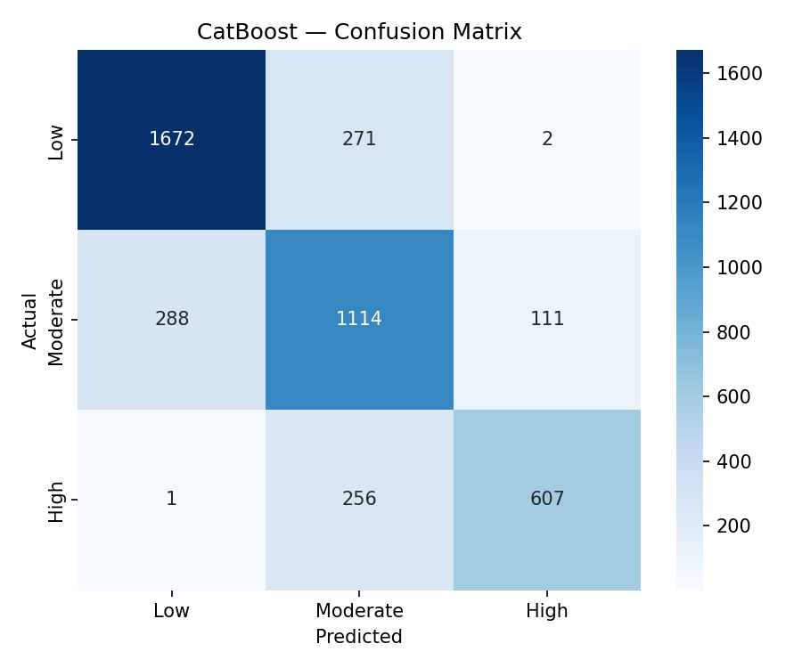

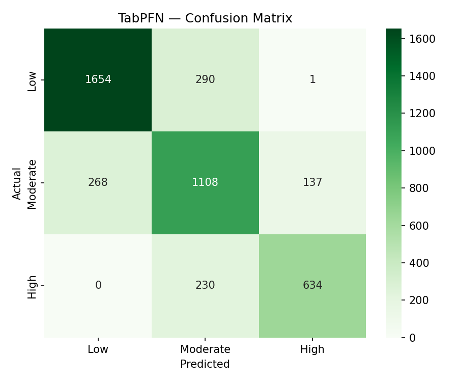

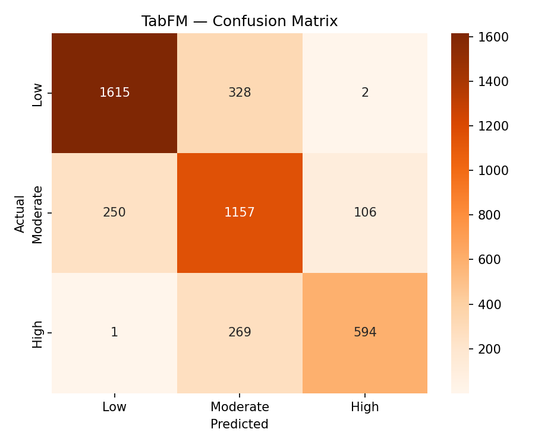

The confusion matrices (Fig. 4.1 to Fig. 4.3) show that almost all errors fell between neighbouring tiers. Only 3 records for CatBoost, 1 for TabPFN and 3 for TabFM were confused between Low and High, out of 929, 926 and 956 misclassified records respectively. The pattern of errors is described in Table 4.3.

Table 4.3: Share of records of each true tier assigned to a neighbouring tier

| Model | Low predicted as Moderate | Moderate predicted as Low | Moderate predicted as High | High predicted as Moderate |
|---|---|---|---|---|
| CatBoost | 13.9% (271) | 19.0% (288) | 7.3% (111) | 29.6% (256) |
| TabPFN | 14.9% (290) | 17.7% (268) | 9.1% (137) | 26.6% (230) |
| TabFM | 16.9% (328) | 16.5% (250) | 7.0% (106) | 31.1% (269) |

Because the tiers are ordered, the errors were also measured with ordinal-aware measures (Table 4.4).

Table 4.4: Ordinal-aware measures

| Model | Cohen's kappa | Quadratic weighted kappa | Within one tier | Mean absolute error (tiers) |
|---|---|---|---|---|
| CatBoost | 0.6586 | 0.8074 | 99.93% | 0.2156 |
| TabPFN | 0.6612 | 0.8115 | 99.98% | 0.2145 |
| TabFM | 0.6495 | 0.7987 | 99.93% | 0.2219 |

Cohen's kappa was about 0.65 to 0.66 for the three models, meaning that they agreed with the true tiers much more than chance would allow. Quadratic weighted kappa was higher, about 0.80 to 0.81, because it gives less weight to errors between neighbouring tiers, and this agrees with the observation that almost all errors were of that kind. At least 99.93% of the predictions were within one tier of the true tier, and the mean absolute error was about 0.22 tiers. The ranking of the three models is the same as in Table 4.1, with TabPFN slightly ahead and TabFM slightly behind, and the differences are small.

The High tier had the lowest recall in every model (0.70, 0.73 and 0.69), and between 26.6% and 31.1% of its records were predicted as Moderate. The Moderate tier had higher recall (0.73 to 0.76) than precision (0.66 to 0.68), which means that the models assigned many records to Moderate that belonged to a neighbouring tier. The two facts are connected: records that truly belong to High but lie near the boundary are absorbed into the large Moderate group. The ordered nature of the target is a likely reason for the weaker Moderate results: the Moderate tier lies between the other two and shares a boundary with each of them, whereas Low and High each border only one tier. This study did not test that explanation with an ordinal model, so it is offered as an interpretation. High-risk records were under-rated as Moderate far more often (26.6% to 31.1%) than Moderate records were over-rated as High (7.0% to 9.1%). For a screening use, a "Moderate" prediction should therefore not be read as excluding high risk.

In practical terms, an accuracy of about 78% means that roughly 22 records in every 100 were placed in a different tier from the true one, and that almost all of these were placed in the neighbouring tier. The models were therefore useful for ranking patients by risk and for separating low from high risk, but they were not precise enough to assign the exact tier with confidence, in particular around the Moderate boundary. This is a description of performance on this dataset, and it is not a statement about clinical use.

4.1.3 Statistical significance

McNemar's test with continuity correction was applied to each pair of models on the same 4,322 records (Table 4.5).

Table 4.5: Pairwise McNemar's test

| Comparison | Statistic | p-value | Significant at α = 0.05 |
|---|---|---|---|
| CatBoost vs TabPFN | 0.0147 | 0.9037 | No |
| CatBoost vs TabFM | 1.6528 | 0.1986 | No |
| TabPFN vs TabFM | 2.5798 | 0.1082 | No |

None of the three differences was significant, so no difference in accuracy was detected between a grid-searched gradient-boosted model, a zero-shot model with the full training data, and a zero-shot model with a 500-row context. A non-significant result does not prove that the models are equivalent. It only shows that the data give no evidence of a difference. The comparison with TabFM was also made at unequal context sizes, which is why Section 4.2 examines the models at matched sizes.

To show how uncertain each accuracy value is, 95% Wilson score intervals were calculated from the accuracy and the number of test records (Table 4.6).

Table 4.6: Accuracy with 95% Wilson score intervals

| Model | Accuracy | 95% interval |
|---|---|---|
| CatBoost | 78.51% | 77.26% to 79.70% |
| TabPFN | 78.57% | 77.33% to 79.77% |
| TabFM | 77.88% | 76.62% to 79.09% |

Each interval is about 2.4 percentage points wide, and the three intervals overlap almost completely, which agrees with the absence of significant differences in Table 4.5. The intervals describe only the uncertainty that comes from the finite test sample. They do not include variation from the choice of training records or from the random seed, which was not measured because each model was trained once.

Summary for Objective 1. The three models reached close performance on the same test records. TabPFN had the highest accuracy, macro-F1 and ROC-AUC, but none of the differences was significant. All three models were weakest on the Moderate tier, and almost all errors fell between neighbouring tiers, with High-risk records most often under-rated as Moderate.

4.2 Effect of training context size

The three models were retrained with 100, 500 and 2,000 training rows (Section 3.8.5). Table 4.7 and Fig. 4.4 give the results. The 100-row and 500-row runs used the full test partition, and the 2,000-row run used a fixed subset of 500 test records for all models. The 2,000-row column can therefore be compared across models but not with the other rows in absolute terms.

Table 4.7: Accuracy and macro-F1 with reduced training context

| Training rows | Test records | CatBoost acc. | TabPFN acc. | TabFM acc. | CatBoost F1 | TabPFN F1 | TabFM F1 |
|---|---|---|---|---|---|---|---|
| 100 | 4,322 | 60.53% | 71.54% | 74.41% | 0.5745 | 0.7062 | 0.7363 |
| 500 | 4,322 | 69.64% | 77.65% | 77.88% | 0.6768 | 0.7691 | 0.7715 |
| 2,000 | 500 | 74.40% | 76.20% | 77.40% | 0.7260 | 0.7508 | 0.7631 |
| Full (17,284) | 4,322 | 78.51% | 78.57% | not run | 0.7763 | 0.7787 | not run |

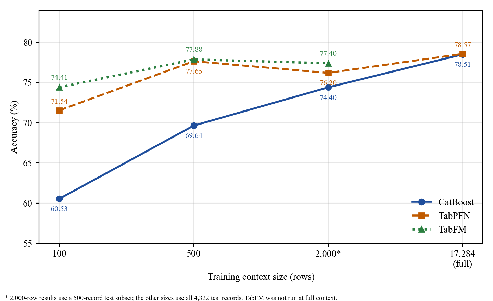

At every reduced size, both foundation models scored higher than CatBoost. At 100 rows, which is under 0.6% of the training partition, CatBoost reached 60.53%, which was 11.01 points below TabPFN and 13.88 points below TabFM. The gaps were 8.01 and 8.24 points at 500 rows and 1.80 and 3.00 points at 2,000 rows, so they narrowed as the context grew, and at full context CatBoost matched TabPFN (78.51% and 78.57%). The macro-F1 values show the same picture, and the gap in macro-F1 at 100 rows (0.5745 for CatBoost against 0.7062 and 0.7363) is even larger than the gap in accuracy. This suggests that CatBoost's errors at 100 rows were concentrated in some tiers, but per-class results were not examined at the reduced sizes.

The foundation models kept most of their full-data performance with small contexts. At 500 rows TabPFN was 0.92 points below its own full-context accuracy, whereas CatBoost was 8.87 points below its own. TabFM at 500 rows was 0.63 points below CatBoost's full-context accuracy while using 2.9% of the training records. From 100 to 500 rows CatBoost gained 9.11 points, TabPFN 6.11 and TabFM 3.47, so the tuned gradient-boosted model depended most on the amount of training data. A plausible reason is that tree splits need enough records in each region of the feature space to be reliable, whereas the foundation models bring knowledge from pretraining. This explanation was not tested in this study.

A practical way to read the same results is to ask how much data each model needed to pass an accuracy of 70%. TabPFN (71.54%) and TabFM (74.41%) passed it with only 100 training rows, whereas CatBoost was still below it with 500 rows (69.64%) and passed it only at 2,000 rows (74.40%, on the smaller test subset). The foundation models therefore needed at least five times less data to reach the same level.

TabFM scored higher than TabPFN at all three reduced sizes, but the margin shrank from 2.87 points at 100 rows to 0.23 points at 500 rows. The 1.20-point margin at 2,000 rows was measured on only 500 records, where the 95% interval for an accuracy near 76% is about ±3.7 points, so the order of the two foundation models cannot be treated as reliable. McNemar's test was not run at the reduced sizes, so no significance claim is made for these comparisons. The full-context TabFM run did not finish (Section 4.4), which is why that cell is empty.

Summary for Objective 2. The amount of training data mattered most for CatBoost. With 100 to 500 rows both foundation models were clearly better, the gap narrowed as the context grew, and with the full training partition CatBoost matched TabPFN. TabFM's rank against TabPFN was not reliable at any size.

4.3 Explainability of the predictions

4.3.1 Relationship between the features and the risk tier in the data

Before the SHAP results are presented, the relationships in the data itself are described (Section 3.8.2). Table 4.8 gives the mean of each continuous predictor in each risk tier, and Table 4.9 gives the proportion of records with each binary flag.

Table 4.8: Mean of the continuous predictors by risk tier

| Predictor | Low | Moderate | High | Spearman correlation with risk tier |
|---|---|---|---|---|
| stress_level | 15.40 | 19.05 | 22.18 | +0.329 |
| iron (µg/dL) | 108.34 | 94.82 | 82.64 | −0.314 |
| total_protein (g/dL) | 7.39 | 7.13 | 6.91 | −0.304 |
| vitamin_d (ng/mL) | 31.23 | 26.92 | 23.18 | −0.262 |
| alt_liver (U/L) | 22.20 | 26.64 | 31.73 | +0.254 |
| calcium (mg/dL) | 9.44 | 9.24 | 9.08 | −0.226 |
| manganese (µg/L) | 8.56 | 7.85 | 7.09 | −0.184 |
| body_water_content (%) | 56.05 | 54.62 | 53.22 | −0.135 |
| age (years) | 31.73 | 33.06 | 34.90 | +0.116 |
| hair_texture | 50.02 | 50.46 | 49.97 | +0.003 |
| total_keratine | 49.91 | 50.10 | 49.40 | −0.006 |

Table 4.9: Proportion of records with each binary flag, by risk tier

| Flag | Low | Moderate | High |
|---|---|---|---|
| stress | 34.2% | 42.8% | 49.9% |
| chemical_use | 33.9% | 42.6% | 48.6% |
| family_hair_fall_history | 28.9% | 37.1% | 42.5% |
| late_night_sleep | 36.5% | 41.3% | 46.4% |
| sleep_disturbance | 31.6% | 36.2% | 41.5% |
| chronic_illness | 25.1% | 31.7% | 37.5% |
| water_reason | 27.0% | 30.6% | 34.6% |
| anemia | 19.8% | 26.3% | 32.5% |

Seven biomarkers (stress_level, iron, total_protein, vitamin_d, alt_liver, calcium and manganese) had the strongest rank correlations with the risk tier, between 0.18 and 0.33 in absolute value, and the direction was as expected for the constructed relationships: higher stress_level and alt_liver with higher risk, and higher iron, protein, vitamin D, calcium and manganese with lower risk. Every binary flag was more common in the High tier than in the Low tier. The two composite hair-condition scores, total_keratine and hair_texture, had correlations close to zero and almost identical means in the three tiers. All correlations are moderate at most, and no single feature separates the tiers, which agrees with the statement in Section 1.1 that risk arises from a combination of factors.

4.3.2 Global feature importance

Fig. 4.5 to Fig. 4.7 rank the features by mean absolute SHAP value. The CatBoost plot covers the full test partition and adds the contributions of the three classes. The TabPFN and TabFM plots cover only the sampled records (30 and 20) and show the High risk class. The bar lengths are on different scales, so the models are compared by rank and not by magnitude. Table 4.10 lists the ten most important features in each model.

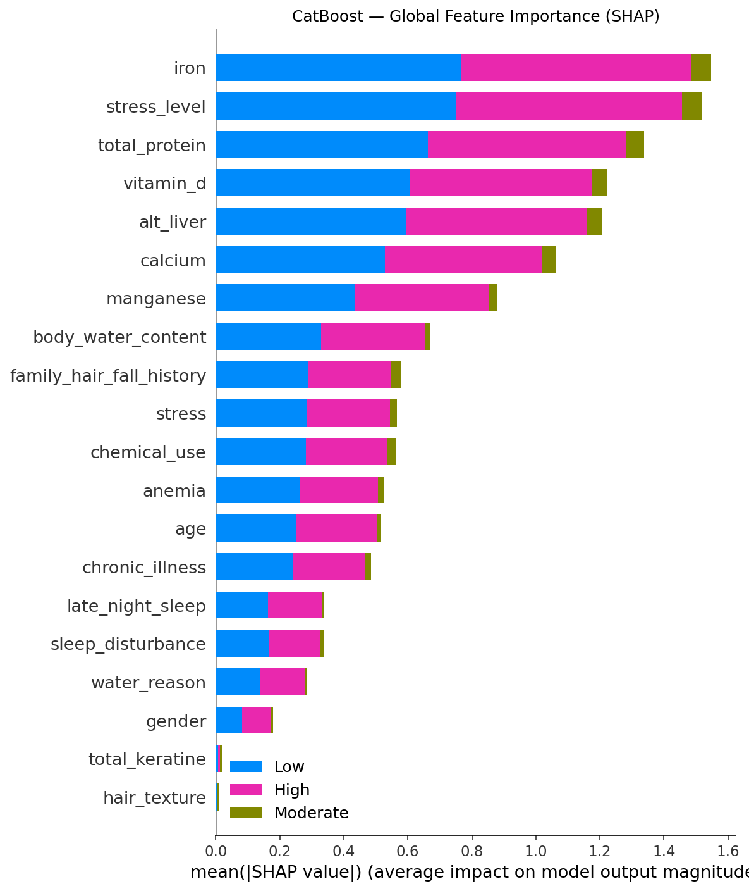

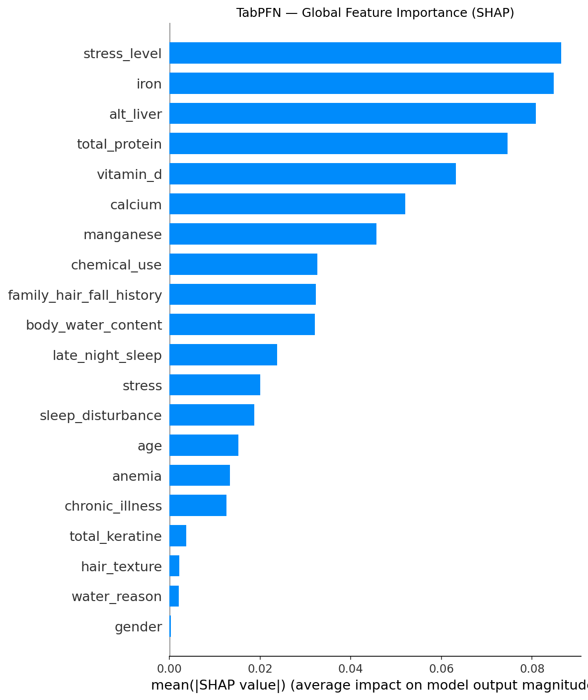

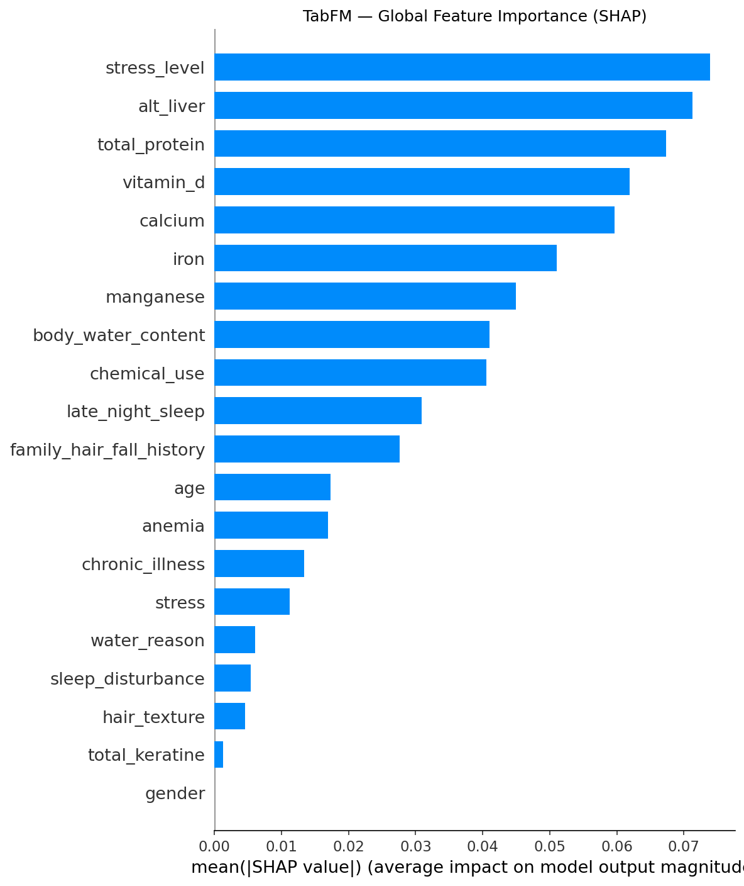

Table 4.10: Ten most important features in each model

| Rank | CatBoost | TabPFN | TabFM |
|---|---|---|---|
| 1 | iron | stress_level | stress_level |
| 2 | stress_level | iron | alt_liver |
| 3 | total_protein | alt_liver | total_protein |
| 4 | vitamin_d | total_protein | vitamin_d |
| 5 | alt_liver | vitamin_d | calcium |
| 6 | calcium | calcium | iron |
| 7 | manganese | manganese | manganese |
| 8 | body_water_content | chemical_use | body_water_content |
| 9 | family_hair_fall_history | family_hair_fall_history | chemical_use |
| 10 | stress | body_water_content | late_night_sleep |

The same seven continuous biomarkers (iron, stress_level, total_protein, vitamin_d, alt_liver, calcium and manganese) were the seven most important features in all three models, and manganese was seventh in each. The models differed mainly in the order within this group. For example, iron was first for CatBoost, second for TabPFN and sixth for TabFM. Because the foundation-model values came from only 20 to 30 records, differences in this order should not be interpreted. Only the shared set of leading features is reported as a finding. The composite scores total_keratine and hair_texture contributed almost nothing in all three models, and gender also contributed very little.

This set of seven features is exactly the set with the strongest rank correlations in Table 4.8, and the two features with almost no correlation are also the two with almost no SHAP importance. The models therefore relied on the features that are most strongly associated with risk in the data, and this gives a consistency check that does not depend on the models themselves.

4.3.3 Direction of the effects

The beeswarm plots (Fig. 4.8 to Fig. 4.10) show how feature values moved the predicted probability of the High risk class.

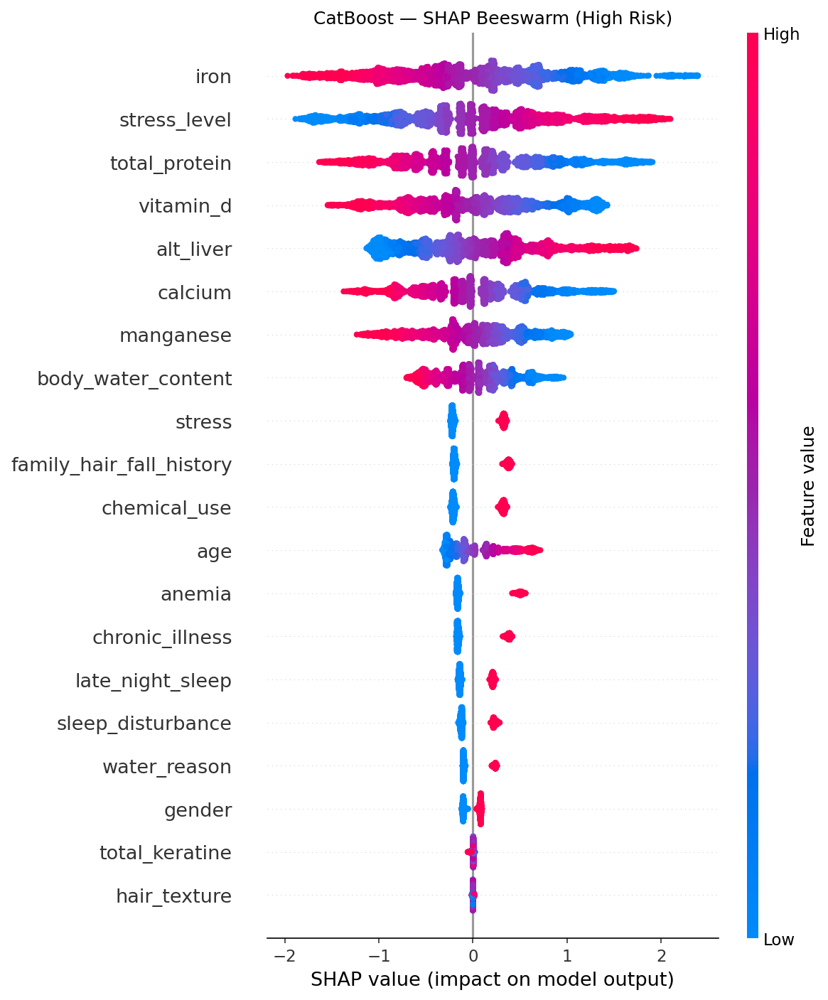

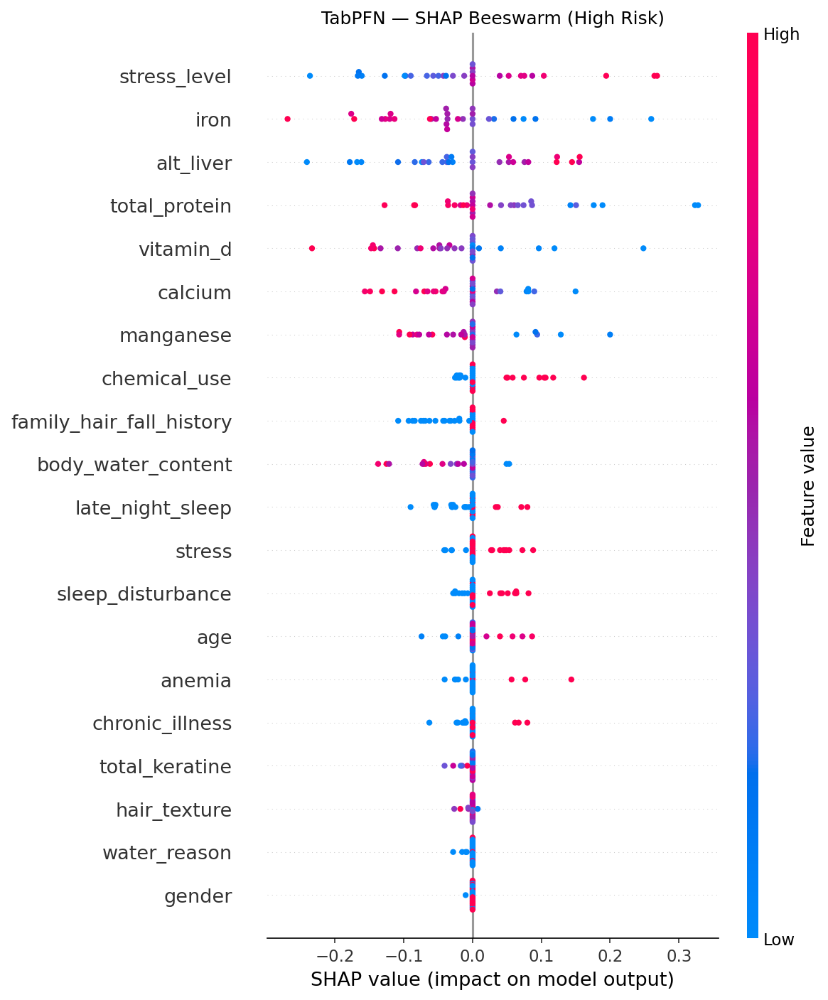

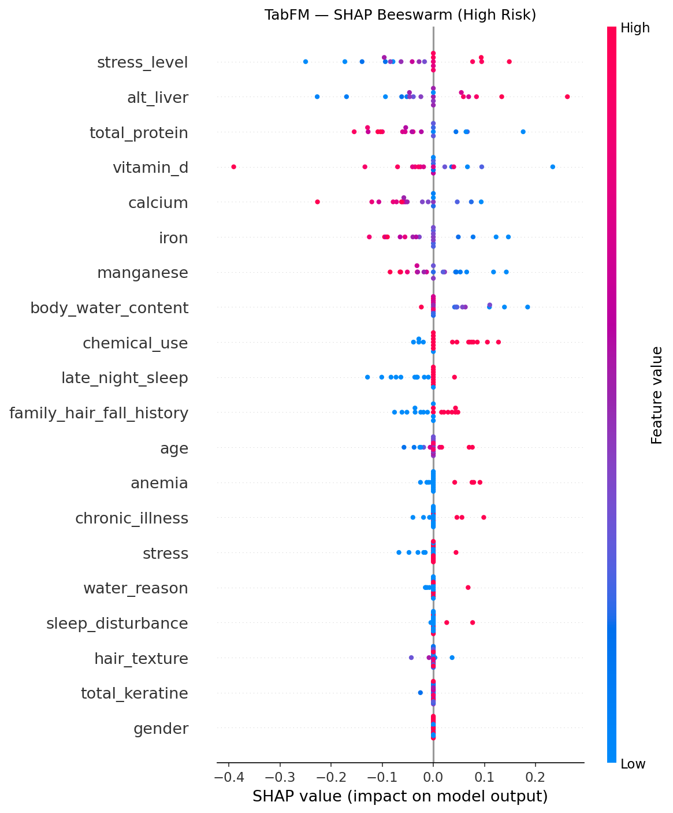

The colour of each point in a beeswarm plot shows the value of the feature for that record (red for high values and blue for low values), and its position on the horizontal axis shows how much that value raised (right) or lowered (left) the predicted probability of High risk. A feature whose red points lie on the left and blue points on the right, such as iron, therefore lowers the predicted risk when its value is high. In all three models, high values of stress_level and alt_liver pushed the prediction toward High risk, and high values of iron, total_protein, vitamin_d, calcium and manganese pushed it away. For CatBoost, higher body_water_content also lowered the High risk contribution, and higher age and every binary risk flag (stress, family_hair_fall_history, chemical_use, anemia, chronic_illness, late_night_sleep, sleep_disturbance and water_reason) raised it. The TabPFN and TabFM plots showed the same direction for the leading biomarkers. These directions agree with the signs of the correlations in Table 4.8 and the differences in Table 4.9.

4.3.4 Differences between the rankings

The rankings in Table 4.10 differ outside the shared set of seven features. TabPFN and TabFM placed chemical_use eighth and ninth, whereas CatBoost placed it lower, and CatBoost placed family_hair_fall_history and the stress flag ninth and tenth. Within the leading seven, iron was first for CatBoost but sixth for TabFM, and stress_level was first for both foundation models. These differences may reflect the different ways in which the models use the features, but they may equally reflect the small samples (30 and 20 records) on which the foundation-model values are based, and Kernel SHAP estimates for features of similar size can change order between runs. The study therefore does not claim that any of these rank differences is a property of a model. The finding that can be relied on is the shared set of leading features and the shared direction of their effects.

4.3.5 Patient-level explanations

Waterfall plots show how the features moved one patient's predicted High risk score from the baseline value to the final value (Fig. 4.11 to Fig. 4.13). The three plots show different patients, because the CatBoost plot uses the first test record and the two foundation-model plots each use the first record of a different random sample, so they should not be compared with each other. They illustrate what a clinician would see for one patient: a short list of features that raised the score and features that lowered it, each with its size.

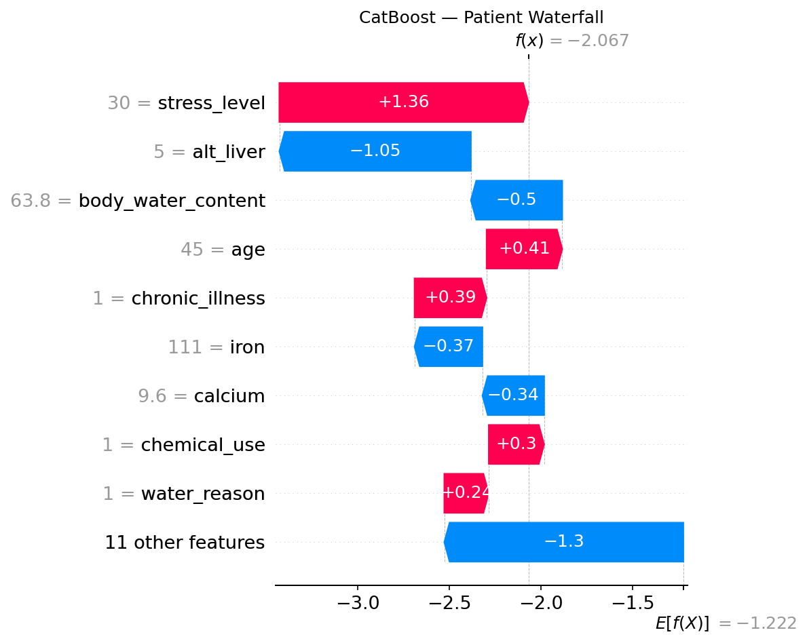

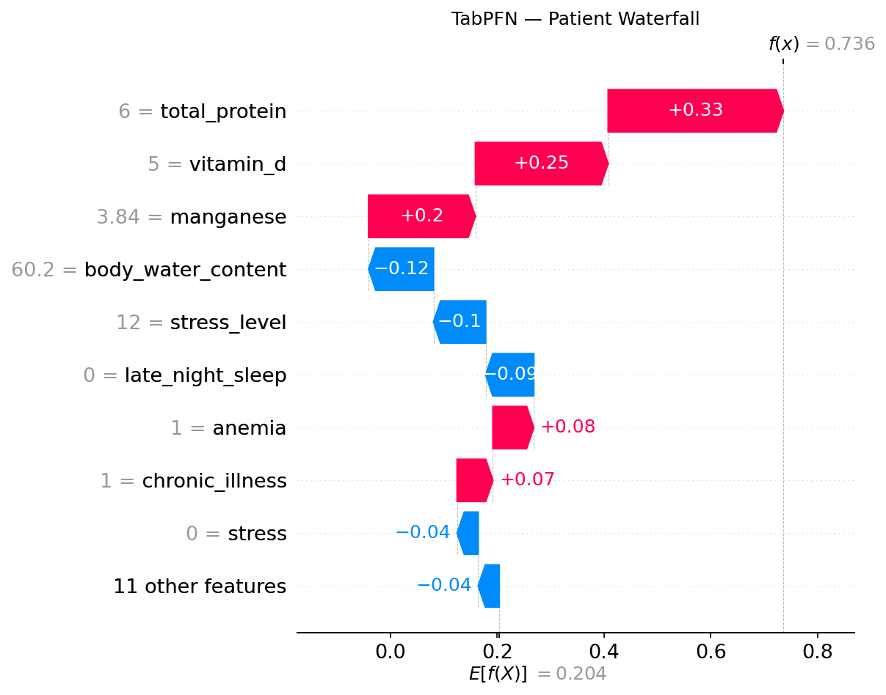

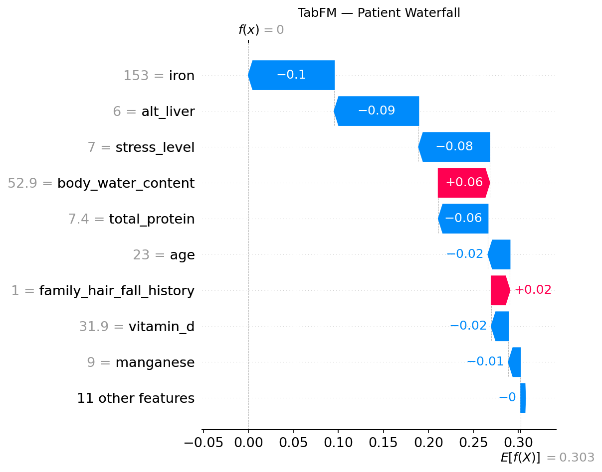

Summary for Objective 3. The same seven biomarkers led the SHAP rankings of all three models, with the same direction of effect. They are also the seven features most strongly correlated with the risk tier in the data, and the two hair-condition scores that carry no association with the tier had almost no importance. The explanations therefore agree with the data. The foundation-model explanations rest on 20 to 30 records, so only the shared set of leading features was interpreted.

4.4 Computational cost and implementation limitations

4.4.1 TabFM runtime

TabFM (version 1.0.0, PyTorch backend) was much slower at prediction than CatBoost and TabPFN, and its running time rose steeply with the size of the training context (Table 4.11). With a 500-row context, predicting the 4,322 test records took approximately 8 minutes. With a 2,000-row context, predicting only 500 test records took approximately 15 minutes. That is about 1.8 seconds per record compared with about 0.11 seconds per record at 500 rows, so a context four times larger made each prediction roughly sixteen times slower. An attempt to use the full 17,284-row context, run in batches of 50 records with results saved after each batch, did not finish within the session limits of the cloud platform. TabFM was therefore evaluated with a 500-row context, the largest tested size that allowed a complete evaluation of the full test partition. A single ensemble member (n_estimators = 1) was used throughout, because the default ensemble setting multiplied the cost of every prediction.

Table 4.11: Approximate TabFM prediction time by context size

| Training context | Test records | Approximate time | Approximate time per record |
|---|---|---|---|
| 500 rows | 4,322 | 8 minutes | 0.11 s |
| 2,000 rows | 500 | 15 minutes | 1.8 s |
| 17,284 rows | 4,322 | Did not finish | – |

The practical meaning is that a model that needs no tuning is not necessarily cheap to use. CatBoost had a training cost and a very small prediction cost, and the foundation models had almost no training cost but a large prediction cost that depends on the context. The choice between them therefore depends on how many predictions are needed and how large the context is.

4.4.2 Software problems and workarounds

Three problems arose while running the models.

1. PermutationExplainer failed. This SHAP method, which had been planned for TabPFN and TabFM, failed with a type-resolution error in numba, the library that shap uses to speed up its masking step. The failure was reproduced on both Google Colaboratory and Kaggle Notebooks. It continued after numba's JIT compilation was disabled with the NUMBA_DISABLE_JIT setting and after numba and llvmlite were reinstalled. KernelExplainer was used instead. It estimates the same Shapley values by querying the model directly, but it is slower, which is why the foundation-model explanations were limited to 30 and 20 test records and a reduced training context. The consequence was a change of method for two of the three models, which is why the SHAP results of CatBoost (exact, all test records) and of the foundation models (estimated, 20 to 30 records) are not treated as equally precise.
2. TabFM failed on single-row input. The predict_proba method failed when called with one row, which KernelExplainer does routinely. A single-row query was therefore duplicated into a two-row batch, and only the first output row was kept. This does not change the prediction for the original record. It may be an upstream defect, but this was not checked against the reported defects in [@pauli].
3. TabPFN checkpoint loading failed. Recent PyTorch versions load checkpoints with weights_only set to True by default, which rejected the TabPFN weights. torch.load was wrapped so that weights_only was False before the model was created. TabPFN's licence token was read from the Kaggle secrets store and not written into the notebook.

These problems came from the recency of the software and not from the modelling approaches. TabFM's runtime growth and its single-row failure were not visible from its documentation and were found by testing, which required changing one variable at a time (context size, batch size and backend) to separate design limits from defects.

Summary for Objective 4. CatBoost and TabPFN ran without difficulty. TabFM was slow, its prediction time grew steeply with the training context, and its full-context evaluation could not be completed. The planned SHAP method failed and was replaced, TabFM failed on single-row input, and TabPFN needed a checkpoint-loading workaround.

4.5 Discussion

4.5.1 Plausibility of the findings

The three models reached close accuracy (77.88% to 78.57%) on a task with three imbalanced tiers, and most errors fell between neighbouring tiers, which is what would be expected when risk changes gradually with the input values. The main features found by SHAP (iron, stress level, total protein, vitamin D, liver enzyme ALT, calcium and manganese) and the direction of their effects agree with the relationships used to construct the dataset (Section 3.7) and with the correlations measured in the data (Section 4.3.1). The result should therefore be read as showing that all three models recovered the relationships built into the data. It is not new clinical evidence, because the data were not collected from a clinical registry. For the same reason, the accuracy values show how well the models perform on this dataset and cannot be taken as the accuracy of a diagnostic tool.

The very small contribution of total_keratine and hair_texture is also plausible in this setting. They are composite scores of hair condition and not laboratory measurements, and the data show almost no association between them and the risk tier (Table 4.8).

A ceiling of about 78% accuracy for all three models, whatever their design, suggests that the limit is set by the information in the features and their overlap between tiers, and not by the choice of model. Three very different methods (tuned trees and two transformers) reached the same level, which is what would be expected if all of them had extracted most of the available signal. This interpretation was not tested directly, for example with additional model families.

4.5.2 Comparison with similar studies

A direct comparison of accuracy values with earlier hair loss studies is not possible, because the studies used different data, targets and metrics. The comparison below is therefore about findings and not about numbers.

- Sai et al. [@sai] found that an ensemble outperformed individual classifiers, and Patel et al. [@patel] found that Random Forest outperformed XGBoost, CatBoost and LightGBM. Both concern classical models on different datasets. The present study did not include these methods, but it adds that a tuned CatBoost and two zero-shot foundation models were not significantly different in accuracy on this dataset (Table 4.5). This agrees with the view in Section 2.8 that the best model depends on the dataset.
- TabFM has been reported to outperform heavily tuned gradient-boosted models on the TabArena benchmark in a zero-shot setting [@kong]. In the present study TabFM was not significantly different from CatBoost (with a much smaller context), and with the same small contexts both foundation models scored higher than CatBoost (Table 4.7). This is consistent with a data-efficiency advantage, but at the full training size no advantage over CatBoost was detected, so the findings support the benchmark report only partly. The independent evaluation [@pauli] found TabFM competitive with XGBoost, Random Forest and TabPFN, and the present result for TabFM against TabPFN and CatBoost points in the same direction.
- TabPFN was reported to outperform tuned tree ensembles on datasets of up to 10,000 samples [@hollmann25]. The present training partition (17,284 rows) is larger than that range, and TabPFN matched CatBoost there, without exceeding it. This suggests that the advantage of TabPFN is greatest with small data and disappears as the training set grows, which agrees with the scaling results in Section 4.2 and with its design for small problems [@hollmann23].
- The studies of Shwartz-Ziv and Armon [@shwartz22] and Grinsztajn et al. [@grinsztajn22] found that tuned trees remain very strong on tabular data. The present result, in which CatBoost was not beaten at full data size, is consistent with them. The result at small data sizes, in which the foundation models were clearly better, shows the situation in which a pretrained model can add value.
- Chen et al. [@chen] observed that neural models gained accuracy but lost interpretability. Here SHAP explanations could be produced for CatBoost and for both transformer-based models, although with more limited samples for the latter, so interpretability did not have to be given up.
- Widowati et al. [@widowati] stressed that transformations must be kept inside cross-validation folds. In the present study the only preprocessing was the removal of identifiers and a fixed coding of gender, so no fitted transformation could leak information, and CatBoost's tuning was done by cross-validation within the training partition.

4.5.3 Implications and cautions

The results suggest that, on this dataset, zero-shot foundation models can be used without a tuning stage and still reach a performance comparable to a tuned CatBoost, and that they are more useful when little training data is available. Three practical consequences follow. First, when a hair fall risk model has to be built from a few hundred labelled records, a pretrained model is a sensible starting point, because the accuracy of CatBoost fell by about nine points from the full data to 500 rows whereas that of TabPFN fell by less than one point. Second, when a large labelled dataset and a fast prediction service are available, a tuned gradient-boosted model performs as well as the foundation models and is much cheaper to run, so there is no accuracy reason to prefer the larger models. Third, whichever model is used, the explanation should be produced and checked against the data, as was done in Section 4.3.1, because a model can be accurate for reasons that a clinician would not accept. Against this, TabFM was slow and could not be run with the full context, and the explanations for the foundation models rest on small samples. The main limitations (a constructed dataset, one data split, the unequal contexts and test sets, the small SHAP samples, and the use of the test partition for CatBoost's early stopping) are discussed in Chapter 5.

4.5.4 Relation of the results to the research questions

Research Question 1 asked whether the zero-shot foundation models can match a tuned CatBoost and whether the differences are significant. The answer from Section 4.1 is that no significant difference in accuracy was detected between any pair of models. Research Question 2 asked how the training context size affects the models. Section 4.2 showed that CatBoost lost much more accuracy than the foundation models when the context was reduced, and that the gap closed as the context grew. Research Question 3 asked which features drive the predictions and whether they agree across models and are plausible. Section 4.3 showed that the same seven biomarkers led all three rankings, with the same direction of effect, in agreement with the relationships measured in the data. Research Question 4 asked about computational cost and limitations. Section 4.4 showed that TabFM's prediction time grew steeply with context size and that several software problems needed workarounds. Chapter 5 draws the conclusions from these answers.
